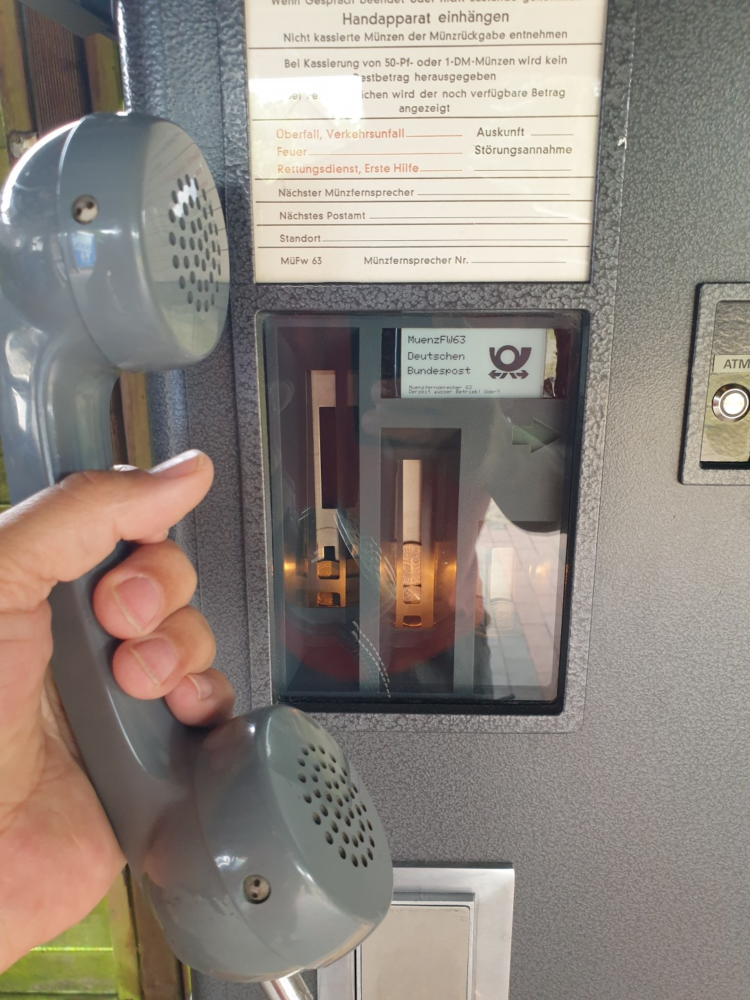
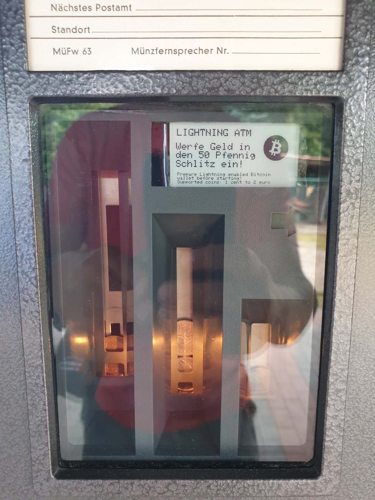
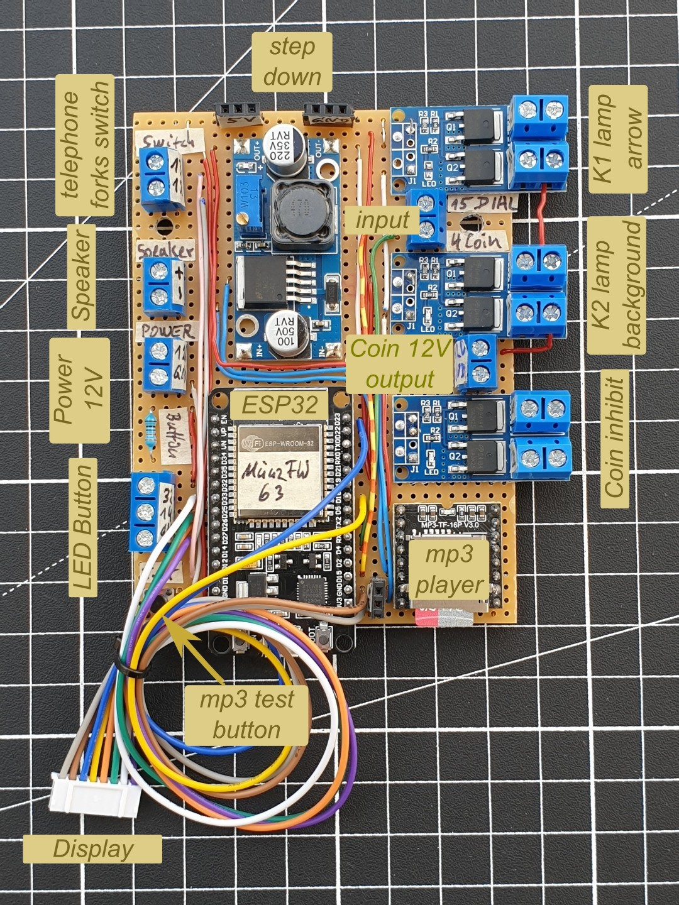
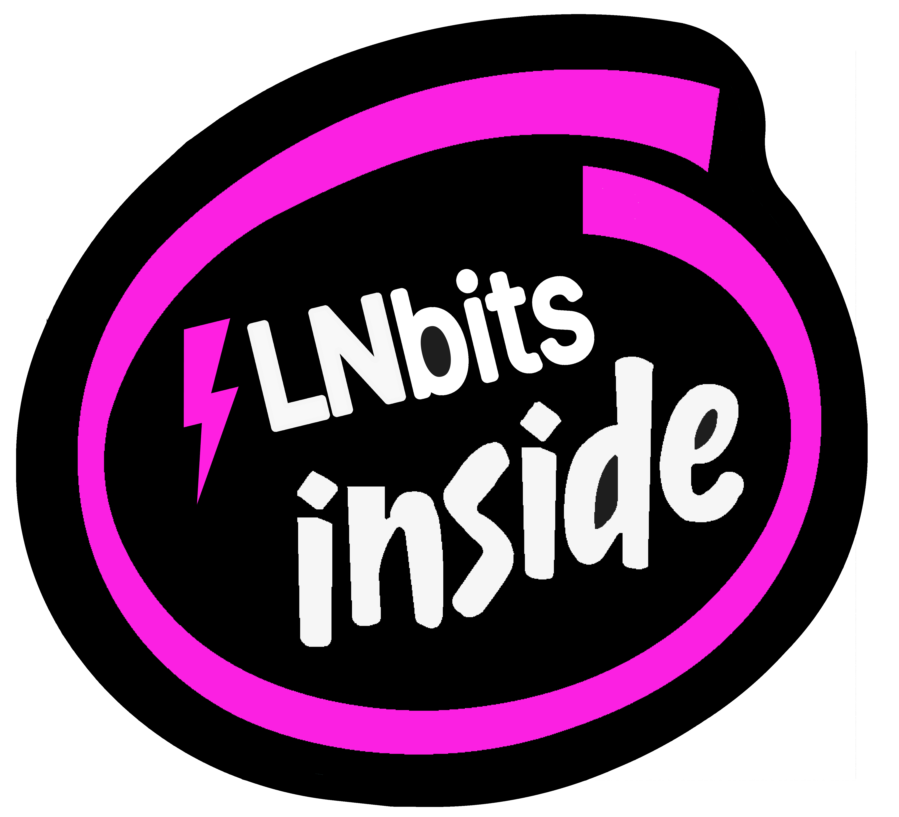

# Muenzer 63
Muenzer 63 - An old remote dial coin box with money changer

The Münzer 63 (manufacturer's designation Siemens AG: MünzFW63) is a coin-operated telephone which was introduced in 1963 and used until the early 1990s. Back then, it was good old German engineering, with lots of electromechanics and mechanical coin testing. It was rescued from the scrap heap by a good friend in the 90s and lovingly stored for 30 years before I was able to give it a second life. 

It is now an offline Lightning ATM with a few extra gadgets, as the dial and handset lent themselves perfectly to user interaction. The coin slot, coin cassette and coin ejector could also be reused. However, the coin check is now carried out electrically. The ATM was also given a display and an LED button. Everything was positioned as inconspicuously as possible so that as little as possible had to be falsified or even damaged from the outside. Externally, it is virtually still original, or can be completely restored. The interior was largely gutted, but as much as possible was reused.

It is a piece of contemporary history that is now to be loaned to Bitcoin events or companies such as hotels, restaurants, etc. with a Bitcoin connection for a certain period of time. It is intended to fascinate as many plebs or PreCoiner as possible and bring the technology of Bitcoin⚡Lightning a little closer.

## Its function 

If you lift the handset, you hear a dial tone and dial a number via the dial disk, you hear various announcements. The announcements do not come from the exchange, but from a small MP3 player which is controlled by an ESP32. With the dial number 9 you hear an announcement that you can activate the Lightning ATM function (automatic teller machine) with the speed dial. Once the ATM has been activated, the display is updated and indicates that you can now insert money into the coin slot. After each coin insertion, the display updates and shows the amount of coins inserted and the LED button lights up. If you press the button, a QR code is displayed. If you scan the QR code with a Lightning wallet of your choice, you can have the Bitcoin Lightning Satoshis transferred to your wallet for the equivalent value of the fiat coins inserted. 

## The technology behind it

The heart of the new Muenzer 63 is an offline ATM based on the GitHub project ["offline-LightningATM-esp32"](https://github.com/f321x/offline-LightningATM-esp32) by Felix. It has a coin validator like the well-known [Lightning ATM](https://github.com/21isenough/LightningATM), except that the controller is not a Rapsberry Pi Zero minicomputer, but an ESP32 and it does not require Wifi, because it also works offline. 

The ATM has been extended a little for the Muenzer 63. It has been given an additional module, a mini MP3 player with a 3 watt amplifier, which communicates with the ESP32 via a serial UART interface and can play MP3 files from an SD card. The ESP32, the module, three Mosfet solid state relays and a 12V/5V voltage converter are soldered onto a strip grid board and the entire board is equipped with connection options. 

## The Hardware

Muenzer 63: [info](http://www.oeffentlichetelefone.de/muenzfernsprecher_muenzfw_63.html) | [old manuals](https://www.wasser.de/telefon-alt/datenbank/inhalt.pl?tin=&kategorie=1000091)  
ESP32 NodeMCU: [Google](https://www.google.com/search?q=esp32+nodemcu)  
DFPlayer Mini - MP3-Player: [data sheet](https://wiki.dfrobot.com/DFPlayer_Mini_SKU_DFR0299) | [Github](https://github.com/DFRobot/DFRobotDFPlayerMini) | [info](https://www.elektronik-kompendium.de/sites/praxis/bauteil_dfplayer-mini.htm) | [code and video](https://prilchen.de/steuerbarer-mp3-files-mit-dfplayer/)  
PWM Mosfet Module (relay): [Google](https://www.google.com/search?q=Mosfet+Modul) | [great documentation](https://github.com/technerdchris/boards/tree/master/D4184)   
Step down converter 12V to 5V: [Google](https://www.google.com/search?q=step+down+lm2596s)  
Power supply 12V: [Google](https://www.google.com/search?q=csu-24V12)  
Coin acceptor: [Google](https://www.google.com/search?q=coin+acceptor)  
Display: [Waveshare](https://www.waveshare.com/product/raspberry-pi/displays/e-paper/2.13inch-e-paper-hat-d.htm?___SID=U)  
Dial: [wiki](https://de.wikipedia.org/wiki/Nummernschalter)  

## Interfaces and functions of the ESP32

Inputs and outputs:

| GPIO | Inputs |
|--------------|------------|
| 14 | Button of the LED button |
| 4 | Pulse input from the coin acceptor |
| 15 | Pulse input of the dial disk | 
| 12 | Query telephone handset fork |
| 13 | Reserve |

| GPIO | Outputs |
|--------------|------------|
| 32 | LED of the LED button |
| 22 | Lock signal coin acceptor (inhibit) |
| 21 | Background light (coins) |
| 19 | Green arrow light |

Interface with MP3 module:

| GPIO| MP3 modul |
|--------------|------------|
| 16/17 | UART2 RX/TX |

Interface with display:

| GPIO | Display |
|--------------|------------|
| 18/23/25/25/27/33 | CLK/DIN/DC/CS/BUSY/RST |  

## Pinout and connectors

The ESP32 pinout you can find [here.](./assets/ESP32-Pinout-Muenzer63.txt)  
The connector front to back [here.](./assets/Muenzer63_connector-front_to_back.txt)  
And the connector front to middle [here.](./assets/Muenzer63_connector-front_to_middle.txt)  

## About the software

As the ESP32 has two core processors, the code here has been optimized so that part of the program runs via the second processor. It is mainly the pulse query of the dial that is queried cyclically. The part of the ATM with the pulses from the coin selector runs on the second processor and is processed in a similar way to a step chain. 

To protect the private wallet data, the LNbits wallet string is stored in the file "private_data.h". It is entered in .gitignore and is ignored when uploading to Github. This prevents you from accidentally uploading the wallet data. There is a file "private_data_example.h" in the "include" directory. It is an example file that must be copied in the same directory and renamed to "private_data.h". Only in this file the string of the LNbits wallet must be adapted. As the file is entered in .gitignore, the content is ignored by Git. Changes do not appear in Git and therefore cannot be accidentally uploaded to GitHub. 

Text to speech converter: [ttsmp3.com](https://ttsmp3.com/)  
UART Com: [microcontrollerslab.com](https://microcontrollerslab.com/esp32-uart-communication-pins-example/)  

## Pictures of the Muenzer 63

  |     |  
:------------------------:|:------------------------:|:------------------------:
  |     |  
  |     |  
  |   |  
  |   |  

## Photos from the original - beforehand

  |     |    |     |  
:------------------------:|:------------------------:|:------------------------:|:------------------------:|:------------------------:
  |     |    |     |  

## Special thanks to

[Daktari⚡️](https://x.com/MaunaLion) who rescued the Muenzer 63 from the scrap heap in the 90s 
and kept it in good condition for over 30 years.

[Flex](https://github.com/f321x) for the great [offline-LightningATM](https://github.com/f321x/offline-LightningATM-esp32). 
In addition to the beautiful exterior of the Muenzer 63, the heart of the project.

[Ben Arc](https://x.com/arcbtc) and the LNbits community for the great [LNbits](https://lnbits.com/).
 
Without which there would never have been such beautiful lightning⚡️functions. 

## If you like it or would like to know more

Lightning⚡Address: <axelhamburch@ereignishorizont.xyz> 
Web: <https://ereignishorizont.xyz/>